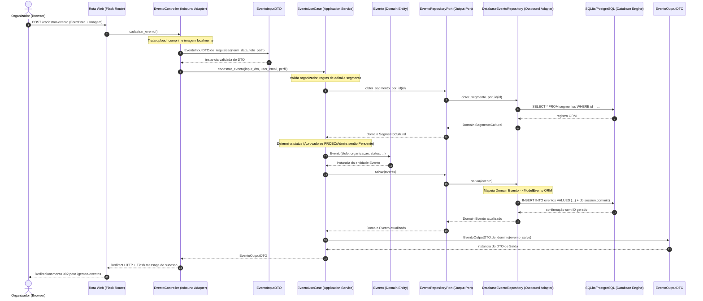

# Guia Canônico de Arquitetura Hexagonal (Ports & Adapters)

Este documento estabelece o padrão canônico de **Arquitetura Hexagonal (Portas e Adaptadores)** adotado no sistema CultiPampa. Ele serve como especificação formal e guia de referência para que desenvolvedores e agentes de Inteligência Artificial compreendam os limites arquiteturais, a inversão de dependência e consigam replicar ou adaptar essa estrutura com precisão para qualquer outro projeto e linguagem.

---

## 1. Princípios Fundamentais e Regra das Dependências

O propósito primário da Arquitetura Hexagonal é isolar a lógica essencial de negócio do software (Domínio e Casos de Uso) de detalhes técnicos externos, tais como frameworks web, bibliotecas de terceiros, drivers de banco de dados, interfaces com o usuário e protocolos de transporte (HTTP, gRPC, CLI, Message Brokers).

### A Regra de Dependência
> **As dependências do código-fonte devem apontar unicamente para dentro, em direção aos Casos de Uso e ao Domínio.**

```
+-----------------------------------------------------------------------+
|  INFRAESTRUTURA EXTERNA (HTTP, Frameworks, Jinja2, Tailwind, JS, CLI) |
|  +-----------------------------------------------------------------+  |
|  |  ADAPTADORES DE ENTRADA / INBOUND (Controllers, API Routes)     |  |
|  |  +-----------------------------------------------------------+  |  |
|  |  |  APLICAÇÃO: PORTAS DE ENTRADA & SAÍDA, DTOs, CASOS DE USO |  |  |
|  |  |  +-----------------------------------------------------+  |  |  |
|  |  |  |  NÚCLEO DE DOMÍNIO: Entidades, VOs, Enums, Regras  |  |  |  |
|  |  |  +-----------------------------------------------------+  |  |  |
|  |  +-----------------------------------------------------------+  |  |
|  |  ADAPTADORES DE SAÍDA / OUTBOUND (Repositories ORM, PDF, Email)|  |
|  +-----------------------------------------------------------------+  |
|  INFRAESTRUTURA EXTERNA (SQLite, PostgreSQL, ReportLab, S3, APIs)     |
+-----------------------------------------------------------------------+
```

1. **Domínio (`domain`)**: Não depende de **nada** externo. É composto por código nativo puro da linguagem escolhida. Não importa Flask, FastAPI, Django, Spring, SQLAlchemy, ORMs ou utilitários web.
2. **Aplicação (`usecase`, `port`, `dto`)**: Depende apenas do Domínio. Define contratos abstratos (Portas) para entrada e saída de dados.
3. **Adaptadores (`controllers`, `infrastructure/outbound`)**: Dependem das abstrações da Aplicação e dos detalhes do framework/banco. Implementam as Portas ou consomem-nas através de injeção de dependência.

---

## 2. Topologia Estrutural de Diretórios

A distribuição de responsabilidades físicas do projeto segue esta árvore:

```
sigac-web/
├── document/                                         # Especificações de requisitos e guias arquiteturais
├── test/                                             # Testes automatizados
│   ├── unit/                                         # Testes puros de Domínio e Casos de Uso (sem banco real)
│   ├── integration/                                  # Testes de Adaptadores (Repositórios e Serviços)
│   └── e2e/                                          # Testes ponta a ponta de fluxos completos
└── source/sigac-web/
    ├── app.py                                        # Ponto de entrada da aplicação
    ├── bootstrap/                                    # Raiz de Composição (App Factory, Injeção e Extensões)
    │   ├── app_factory.py                            # Inicialização do app e registro de rotas
    │   └── database.py                               # Conexão e contexto com o banco de dados
    ├── application/                                  # NÚCLEO DA APLICAÇÃO (Agnóstico de Web e DB)
    │   ├── domain/                                   # Modelos e regras de negócio puras
    │   │   ├── entity/                               # Entidades de domínio ricas
    │   │   ├── vo/                                   # Objetos de Valor (Value Objects imutáveis)
    │   │   ├── enum/                                 # Enumerações de negócio
    │   │   ├── exception/                            # Exceções personalizadas de domínio
    │   │   └── service/                              # Serviços de domínio entre entidades
    │   ├── dto/                                      # Contratos de Transferência de Dados
    │   │   ├── input/                                # DTOs de Entrada (validação sintática de payload)
    │   │   └── output/                               # DTOs de Saída (projeções seguras para a borda)
    │   ├── port/                                     # Interfaces e Abstrações Formais
    │   │   ├── input/                                # Portas Primárias / Driving (Casos de Uso)
    │   │   └── output/                               # Portas Secundárias / Driven (Persistência e Serviços)
    │   └── usecase/                                  # Implementações dos Casos de Uso da aplicação
    ├── controllers/                                  # Adaptadores de Entrada (Tratamento HTTP / Web)
    └── infrastructure/                               # Adaptadores e Recursos de Infraestrutura
        ├── inbound/                                  # Adaptadores de Entrada e Interface com Usuário
        │   └── web/
        │       ├── http/                             # Definição de Rotas, Middlewares e Decorators
        │       ├── templates/                        # Templates HTML (Apenas Jinja2, sem CSS/JS inline)
        │       └── static/                           # Ativos estáticos compilados (css/, javascript/)
        └── outbound/                                 # Adaptadores de Saída
            ├── persistence/                          # Implementações de Banco de Dados
            │   ├── model/                            # Modelos do ORM (Mapeamento de tabelas/colunas)
            │   ├── repository/                       # Repositórios concretos que implementam Output Ports
            │   └── migration/                        # Scripts de controle de versão do esquema (Alembic)
            └── pdf/                                  # Serviços externos concretos (ex.: gerador PDF)
```

---

## 3. Anatomia das Camadas e Seus Contratos

### 3.1 Camada de Domínio (`application/domain/`)
* **Entidades (`entity/`)**: Classes com identidade única (`id`), contendo atributos de estado e regras intrínsecas de negócio.
* **Objetos de Valor (`vo/`)**: Estruturas imutáveis cuja igualdade é baseada em valor (ex.: `EmailVO`, `CPF`, `CoordenadasGeograficas`), responsáveis por autovalidação no momento da instanciação.
* **Exceções de Domínio (`exception/`)**: Erros semânticos do negócio (ex.: `EventoJaEncerradoException`).
* **Regra**: Esta camada **jamais** importa módulos de `infrastructure/`, `controllers/` ou bibliotecas como SQLAlchemy, Flask, Django, etc.

### 3.2 Portas da Aplicação (`application/port/`)
As portas são interfaces abstratas (definidas via `abc.ABC` no Python ou `interface` em TypeScript/Java/Go):
1. **Portas de Entrada (Driving / Primary Ports - `port/input/`)**:
   - Definem as ações que os atores externos (usuário via Web, sistema externo via API, agendador via cron) podem solicitar ao sistema.
   - O Caso de Uso é a implementação concreta da Porta de Entrada.
2. **Portas de Saída (Driven / Secondary Ports - `port/output/`)**:
   - Definem as operações que a aplicação exige do mundo externo (persistir entidades, enviar e-mails, gerar PDFs, consultar APIs de pagamento).
   - Os Adaptadores em `infrastructure/outbound/` são as implementações concretas dessas portas.

### 3.3 Data Transfer Objects (`application/dto/`)
Protegem o núcleo do sistema contra formatos brutos de requisição (JSON, FormData, Parâmetros de Query):
* **Input DTO (`dto/input/`)**:
  - Recebe dados brutos da borda (adaptador de entrada).
  - Executa sanitização, tipagem defensiva e validação de formato.
  - Provê métodos de fábrica (ex.: `de_requisicao(dados: dict)`).
* **Output DTO (`dto/output/`)**:
  - Encapsula exclusivamente os dados que o chamador externo precisa visualizar.
  - Impede o vazamento acidental de entidades de domínio completas ou de modelos do banco de dados.

### 3.4 Casos de Uso (`application/usecase/`)
* Representam os fluxos de trabalho do sistema (User Stories ou regras de negócio aplicadas).
* Implementam uma Porta de Entrada (`port/input/`).
* Recebem suas dependências (Portas de Saída) via construtor (Injeção de Dependência).
* Orquestram o fluxo:
  1. Carregam entidades através de portas de repositório (`port/output/`).
  2. Acionam métodos de negócio nas entidades de domínio.
  3. Verificam regras condicionais e integridade transacional.
  4. Salvam alterações através de portas de persistência.
  5. Mapeiam o resultado em um DTO de Saída e o retornam.

### 3.5 Adaptadores de Entrada (`controllers/`, `infrastructure/inbound/`)
* Recebem eventos externos (HTTP Request, CLI args, WebSockets).
* Extraem dados da sessão, parâmetros e arquivos (ex.: tratamento de uploads, parsing de JSON).
* Instanciam o DTO de entrada.
* Executam o Caso de Uso através da sua Porta de Entrada.
* Capturam exceções de negócio e convertem-nas na resposta HTTP adequada (códigos de status, renderização de template com mensagens de erro flash ou payloads JSON).

### 3.6 Adaptadores de Saída (`infrastructure/outbound/`)
* Implementam as Portas de Saída (`port/output/`).
* Encapsulam bibliotecas externas (SQLAlchemy, Boto3, ReportLab, SendGrid, Redis).
* Realizam a tradução bidirecional (Mapping):
  - **Do Domínio para a Infraestrutura**: Converte a Entidade de Domínio no Modelo ORM correspondente para escrita.
  - **Da Infraestrutura para o Domínio**: Método de fábrica (ex.: `_para_dominio()`), que lê registros do ORM e instancia Entidades de Domínio puras.

---

## 4. Estudo de Caso Ponta a Ponta: Criação e Moderação de Eventos (US05)

O fluxo a seguir ilustra a travessia completa de uma operação de criação de evento cultural:

### 4.1 Diagrama de Sequência Arquitetural



---

### 4.2 Dissecando o Código Camada por Camada

Abaixo estão os contratos reais extraídos da implementação do CultiPampa:

#### 1. Adaptador de Entrada (Inbound): `controllers/evento_controller.py`
Responsável pelo protocolo HTTP, tratamento físico de arquivos e conversão para o DTO:
```python
class EventoController:
    def __init__(
        self,
        evento_repository: EventoRepositoryPort = None,
        user_repository: UserRepositoryPort = None,
        edital_repository: EditalRepositoryPort = None,
        usecase: EventoUseCasePort = None
    ):
        # Injeção de dependências com fallback para adaptadores concretos
        self.evento_repo = evento_repository or DatabaseEventoRepository()
        self.user_repo = user_repository or DatabaseUserRepository()
        self.edital_repo = edital_repository or DatabaseEditalRepository()
        self.usecase = usecase or EventoUseCase(self.evento_repo, self.user_repo, self.edital_repo)

    def cadastrar_evento(self):
        user = session.get('user')
        if not user:
            return redirect(url_for('auth.index'))

        if request.method == 'POST':
            try:
                # 1. Trata infraestrutura de arquivos físicos
                foto_path = salvar_e_comprimir_imagem(request.files.get('foto_evento'), UPLOADS_DIR)
                
                # 2. Constrói DTO a partir de dados da borda
                input_dto = EventoInputDTO.de_requisicao(request.form.to_dict(), foto_path)
                
                # 3. Executa caso de uso através da porta
                output_dto = self.usecase.cadastrar_evento(input_dto, user['email'], user.get('perfil'))
                
                flash("Evento cadastrado com sucesso!", "success")
                return redirect(url_for('auth.gestao_eventos'))
            except ValueError as err:
                return render_template('organizador_cadastrar_evento.html', error=str(err))
```

#### 2. DTO de Entrada: `application/dto/input/evento_input_dto.py`
Encapsula os campos e faz validação sintática antes de alcançar as regras de negócio:
```python
class EventoInputDTO:
    def __init__(self, titulo_evento: str, segmento_cultural_id: int, data_inicio: str, ...):
        self.titulo_evento = titulo_evento.strip() if titulo_evento else ""
        self.segmento_cultural_id = int(segmento_cultural_id)
        self.data_inicio = data_inicio
        # Validações de formato (datas, campos obrigatórios)

    @classmethod
    def de_requisicao(cls, form: dict, foto_path: str | None) -> "EventoInputDTO":
        return cls(
            titulo_evento=form.get("titulo_evento"),
            segmento_cultural_id=form.get("segmento_cultural_id"),
            imagem_divulgacao=foto_path,
            ...
        )
```

#### 3. Porta de Entrada (Primary Port): `application/port/input/evento_usecase_port.py`
Contrato que desacopla o controlador da implementação concreta do caso de uso:
```python
from abc import ABC, abstractmethod

class EventoUseCasePort(ABC):
    @abstractmethod
    def cadastrar_evento(self, input_dto: EventoInputDTO, user_email: str, user_perfil: str | None = None) -> EventoOutputDTO:
        """Cadastra um novo evento associando-o ao organizador correspondente."""
        pass
```

#### 4. Caso de Uso (Application Service): `application/usecase/evento_usecase.py`
Orquestrador de negócio. Contém a lógica de aplicação pura e interage apenas com portas:
```python
class EventoUseCase(EventoUseCasePort):
    def __init__(self, evento_repository: EventoRepositoryPort, user_repository: UserRepositoryPort, edital_repository: EditalRepositoryPort):
        self.evento_repository = evento_repository
        self.user_repository = user_repository
        self.edital_repository = edital_repository

    def cadastrar_evento(self, input_dto: EventoInputDTO, user_email: str, user_perfil: str | None = None) -> EventoOutputDTO:
        # Regra 1: Validação de existência do organizador
        organizador = self.user_repository.obter_por_email(user_email)
        if not organizador:
            raise ValueError("Organizador não localizado.")

        # Regra 2: Validação de dependência do segmento cultural
        segmento = self.evento_repository.obter_segmento_por_id(input_dto.segmento_cultural_id)
        if not segmento:
            raise ValueError("Segmento cultural inválido.")

        # Regra 3: Determinação do ciclo de vida/status
        # Eventos submetidos por PROEC ou Administradores são aprovados automaticamente
        perfil = (user_perfil or "").strip().upper()
        status_inicial = "Aprovado" if perfil in ["PROEC", "ADMINISTRADOR", "ADMIN"] else "Pendente"

        # 4. Instancia a Entidade Pura de Domínio
        evento_dominio = Evento(
            id=None,
            titulo_evento=input_dto.titulo_evento,
            organizador_id=organizador.id,
            status=status_inicial,
            ...
        )

        # 5. Persiste através da Porta de Saída
        evento_salvo = self.evento_repository.salvar(evento_dominio)

        # 6. Retorna DTO de Saída
        return EventoOutputDTO.de_dominio(evento_salvo)
```

#### 5. Entidade Pura de Domínio: `application/domain/entity/evento.py`
Zero dependência de bibliotecas externas:
```python
class Evento:
    """Entidade de Domínio Pura que representa um Evento Cultural."""
    def __init__(
        self,
        id: int | None,
        titulo_evento: str,
        organizador_id: int,
        status: str = "Pendente",
        ...
    ):
        self.id = id
        self.titulo_evento = titulo_evento
        self.organizador_id = organizador_id
        self.status = status

    def aprovar(self, parecer: str):
        """Regra intrínseca de alteração de estado."""
        self.status = "Aprovado"
        self.parecer_proec = parecer
```

#### 6. Porta de Saída (Secondary Port): `application/port/output/evento_repository_port.py`
Contrato que a infraestrutura de persistência é obrigada a cumprir:
```python
from abc import ABC, abstractmethod

class EventoRepositoryPort(ABC):
    @abstractmethod
    def salvar(self, evento: Evento) -> Evento:
        """Persiste um evento (inserção ou atualização) no mecanismo de armazenamento."""
        pass

    @abstractmethod
    def obter_por_id(self, id: int) -> Evento | None:
        """Recupera um evento por ID, retornando a entidade de domínio pura."""
        pass
```

#### 7. Adaptador de Saída (Outbound): `infrastructure/outbound/persistence/repository/database_evento_repository.py`
Implementa a porta de saída, manuseia o ORM (SQLAlchemy) e realiza o mapeamento:
```python
class DatabaseEventoRepository(EventoRepositoryPort):
    def _para_dominio(self, model: ModelEvento) -> DomainEvento:
        """Traduz modelo relacional do SQLAlchemy para Entidade Pura de Domínio."""
        return DomainEvento(
            id=model.id,
            titulo_evento=model.titulo_evento,
            organizador_id=model.organizador_id,
            status=model.status,
            ...
        )

    def salvar(self, evento: DomainEvento) -> DomainEvento:
        if evento.id:
            model = db.session.get(ModelEvento, evento.id)
        else:
            model = ModelEvento()
            db.session.add(model)

        # Atualiza campos da tabela a partir da entidade de domínio
        model.titulo_evento = evento.titulo_evento
        model.organizador_id = evento.organizador_id
        model.status = evento.status

        db.session.commit()
        
        # Reconverte para domínio refletindo o ID gerado pelo banco
        return self._para_dominio(model)
```

---

## 5. Matriz de Adaptação para Novos Projetos e Tecnologias

Qualquer agente de IA ou arquiteto pode transpor este padrão para outras linguagens e pilhas tecnológicas seguindo a correlação de componentes abaixo:

| Conceito Hexagonal | Python (Flask / SQLAlchemy) | TypeScript (NestJS / Prisma) | Go (StdLib / GORM / SQLX) | Java / Kotlin (Spring Boot / JPA) | C# (.NET Core / EF Core) |
| :--- | :--- | :--- | :--- | :--- | :--- |
| **Inbound Adapter** | `controllers/*_controller.py` | `@Controller()` em `*.controller.ts` | `handler.go` (HTTP router / Gin) | `@RestController` / `@Controller` | `[ApiController]` / Controller |
| **Input Port** | `application/port/input/*_port.py` (`ABC`) | `I*UseCase.ts` (`interface`) | `type *UseCase interface` | `public interface *UseCase` | `public interface I*UseCase` |
| **Input DTO** | `application/dto/input/*_dto.py` | `*.dto.ts` (class-validator) | `type *InputDTO struct` | `record *InputDTO(...)` | `public record *InputDTO(...)` |
| **Use Case** | `application/usecase/*_usecase.py` | `@Injectable() class *UseCase` | `type *Service struct` | `@Service public class *UseCase` | `public class *UseCase : I*UseCase` |
| **Domain Entity** | `application/domain/entity/*.py` | `domain/*.entity.ts` (POJO) | `type * struct` (pure struct) | `public class *` (sem anotações JPA) | `public class *` (POCO puro) |
| **Output Port** | `application/port/output/*_port.py` (`ABC`)| `I*Repository.ts` (`interface`) | `type *Repository interface`| `public interface *Repository` | `public interface I*Repository` |
| **Outbound Adapter**| `infrastructure/outbound/repository/*` | `*.repository.ts` (PrismaService) | `repository.go` (SQL/GORM) | `@Repository class Jpa*Adapter` | `public class *Repository : I*Repository` |
| **DB Model / ORM** | `infrastructure/outbound/model/*.py` | `schema.prisma` / TypeORM Entity | DB Table Schemas | `@Entity public class *JpaEntity`| `public class *DbModel` (DbSet) |

---

## 6. Checklist de Conformidade Arquitetural (Regras Invioláveis)

Ao criar ou refatorar funcionalidades em um projeto que utiliza esta arquitetura, verifique cada uma das restrições:

- [ ] **Pureza do Domínio**: Nenhuma entidade em `application/domain/` importa bibliotecas de infraestrutura (frameworks web, ORMs, bibliotecas de serialização de terceiros).
- [ ] **Independência dos Casos de Uso**: Casos de uso dependem exclusivamente de **Portas de Saída** (interfaces abstratas) e nunca de classes concretas de repositórios ou serviços.
- [ ] **Controle de Vazamento (Leaky Abstraction)**: Modelos de ORM (ex.: `ModelEvento`) ou conexões de banco de dados (`db.session`) **nunca** atravessam a barreira do repositório para o Caso de Uso ou Controller.
- [ ] **Fronteira com DTOs**: O Controller nunca envia dados brutos da requisição HTTP diretamente para a entidade de domínio. A transformação deve ocorrer através de um `InputDTO`.
- [ ] **Separação Estrita de Código Front-end**: Templates de visualização (HTML/Jinja2) não contêm lógica CSS inline ou scripts JavaScript embutidos. Todo CSS reside em arquivos compilados dedicados e todo JavaScript em módulos externos.
- [ ] **Testabilidade Unitária sem Mock de Banco**: Deve ser possível instanciar qualquer `UseCase` em testes unitários passando implementações falsas em memória (In-Memory Mocks/Fakes) das suas portas de saída, sem precisar de banco de dados ativo.
